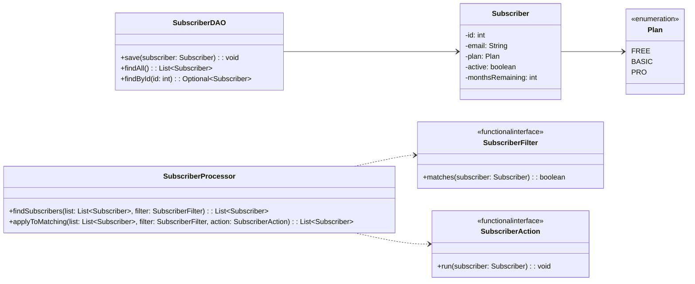

# Workshop — Functional Programming

## Objectives

Your task is to build a **simple subscription list management system** by following the provided **UML class diagram**.  
The goal is to translate the diagram into working code that respects the structure and responsibilities of each class.

You will create core components such as subscribers, subscription plans, and a data access class to store and retrieve subscribers.  
You will then work with lists of subscribers and apply different rules, such as identifying active users or updating subscriptions.

## UML Class Diagram (Conceptual)

## Part 1

### Core Rules to Implement

Define and apply the following **business rules** using functional interfaces (`SubscriberFilter` and `SubscriberAction`).

1. **Active Subscriber**  
   Matches subscribers whose account is active.

2. **Expiring Subscription**  
   Matches subscribers with `0` or `1` month remaining.

3. **Active and Expiring Subscriber**  
   Matches subscribers who are active and whose subscription is about to expire.

4. **Subscriber by Plan**  
   Matches subscribers based on their subscription plan (`FREE`, `BASIC`, or `PRO`).

5. **Paying Subscriber**  
   Matches subscribers with a paid plan (`BASIC` or `PRO`).

6. **Extend Subscription**  
   Increases the remaining subscription period for a subscriber.

7. **Deactivate Subscriber**  
   Marks a subscriber as inactive.

## Part 2 — (Optional / Challenge)

Write **JUnit tests** for the core business logic.

- **Scenario 1: Show Active Subscribers**  
  Display all subscribers that are active.

- **Scenario 2: Show Expiring Subscriptions**  
  Display subscribers with 0 or 1 month remaining.

- **Scenario 3: Show Active and Expiring Subscribers**  
  Display subscribers who are active and whose subscriptions are about to expire.

- **Scenario 4: Extend Subscriptions for Paying Subscribers**  
  Extend subscriptions for active, paying subscribers with expiring subscriptions.

- **Scenario 5: Deactivate Expired Free Subscribers**  
  Deactivate free subscribers whose subscriptions have expired.

- **Scenario 6: Filter Subscribers by Plan**  
  Display subscribers based on their subscription plan (FREE, BASIC, or PRO).

- **Add more scenarios as you see fit!**